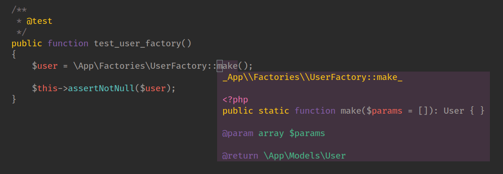

# laravel-dynamic-factories :factory:

> Dynamically wrap factories for happier IDEs

[](https://packagist.org/packages/mblarsen/laravel-dynamic-factories)
[](https://travis-ci.org/mblarsen/laravel-dynamic-factories)
[](https://scrutinizer-ci.com/g/mblarsen/laravel-dynamic-factories)
[](https://packagist.org/packages/mblarsen/laravel-dynamic-factories)

After watching [Laravel Factories Reloaded](https://vimeo.com/394206923) by
[Christoph Rumpel](https://github.com/christophrumpel) I wanted to see if was
possible to generate the factory classes on the fly. The purpose as Christoph
explains in his video is to get better IDE support as the `factory()` helper
returns `mixed`. And you would otherwise have to cast whatever is returned
yourself using comments.

> This package is just a proof of concept and shouldn't be used.

Anyway, this package works by utilizing your existing Laravel factories and
wrapping them to make them "type-safe" for your IDE.



_The factory in the demo screenshot was never created but automatically provided by this package._

## Installation

You can install the package via composer:

```bash
composer require mblarsen/laravel-dynamic-factories
```

Publish the config with:

```bash
php artisan vendor:publish
```

## Usage

First create a factory if you don't already have one:

```bash
php artisan make:factory UserFactory
```

Then start writing tests like this:

```php
<?php

namespace Tests\Feature;

use Mblarsen\LaravelDynamicFactories\LaravelDynamicFactoriesFacade;
use Tests\TestCase;

class ExampleTest extends TestCase
{
    public function setUp(): void
    {
        parent::setUp();
        // LaravelDynamicFactories uses spl_autoload_register to dynamicly create
        // requested classes. It automatically inserts itself before composers
        // autoload, but unlike composer it doesn't throw if a class is not found.
        // what gets intercepted and wrapped is controlled by the config.
        LaravelDynamicFactoriesFacade::enableLoader();
    }

    public function test_user_factory()
    {
        // This class doesn't exist before the first run of the test, so your
        // IDE will not be happy, but your test will be just fine.
        // After the first time your IDE picks up the class.
        $user = \App\Factories\UserFactory::make();

        $this->assertNotNull($user);
    }
}
```

## Config

By default generated classes are stored internally in
`vendor/mblarsen/laravel-dynamic-factories/generated`. But you can change the
location with the config key `path`.

```php
return [
    ...
    "path" => __DIR__."/../database/factory-classes/",
    ...
];
```

My default Laravel's models "live" in the App-namespace. If you like many have
moved this to `App\Models` or use a domain approach and have them spread across
the repo you should change the value of the key `model_namespaces`:

```php
return [
    ...
    "model_namespaces" => [
        "App\\Models"
    ]
    ...
];
```

or

```php
return [
    ...
    "model_namespaces" => [
        "Domain\\People\\Models",
        "Domain\\Documents\\Models"
    ]
    ...
];
```

### Testing

```bash
composer test
```

### Changelog

Please see [CHANGELOG](CHANGELOG.md) for more information what has changed recently.

## Contributing

Please see [CONTRIBUTING](CONTRIBUTING.md) for details.

### Security

If you discover any security related issues, please email m19n@pm.me instead of using the issue tracker.

## Credits

-   [Michael Bøcker-Larsen](https://github.com/mblarsen)
-   [All Contributors](../../contributors)

## License

The MIT License (MIT). Please see [License File](LICENSE.md) for more information.

## Laravel Package Boilerplate

This package was generated using the [Laravel Package Boilerplate](https://laravelpackageboilerplate.com).

